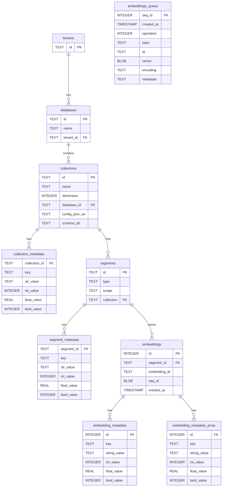

# ChromaDB SQLite Schema

```mermaid
erDiagram
    tenants {
        TEXT id PK
    }

    databases {
        TEXT id PK
        TEXT name
        TEXT tenant_id FK
    }

    collections {
        TEXT id PK
        TEXT name
        INTEGER dimension
        TEXT database_id FK
        TEXT config_json_str
        TEXT schema_str
    }

    collection_metadata {
        TEXT collection_id FK
        TEXT key
        TEXT str_value
        INTEGER int_value
        REAL float_value
        INTEGER bool_value
    }

    segments {
        TEXT id PK
        TEXT type
        TEXT scope
        TEXT collection FK
    }

    segment_metadata {
        TEXT segment_id FK
        TEXT key
        TEXT str_value
        INTEGER int_value
        REAL float_value
        INTEGER bool_value
    }

    embeddings {
        INTEGER id PK
        TEXT segment_id FK
        TEXT embedding_id
        BLOB seq_id
        TIMESTAMP created_at
    }

    embedding_metadata {
        INTEGER id FK
        TEXT key
        TEXT string_value
        INTEGER int_value
        REAL float_value
        INTEGER bool_value
    }

    embedding_metadata_array {
        INTEGER id FK
        TEXT key
        TEXT string_value
        INTEGER int_value
        REAL float_value
        INTEGER bool_value
    }

    embeddings_queue {
        INTEGER seq_id PK
        TIMESTAMP created_at
        INTEGER operation
        TEXT topic
        TEXT id
        BLOB vector
        TEXT encoding
        TEXT metadata
    }

    tenants ||--o{ databases : "has"
    databases ||--o{ collections : "contains"
    collections ||--o{ collection_metadata : "has"
    collections ||--o{ segments : "has"
    segments ||--o{ segment_metadata : "has"
    segments ||--o{ embeddings : "stores"
    embeddings ||--o{ embedding_metadata : "has"
    embeddings ||--o{ embedding_metadata_array : "has"
```
